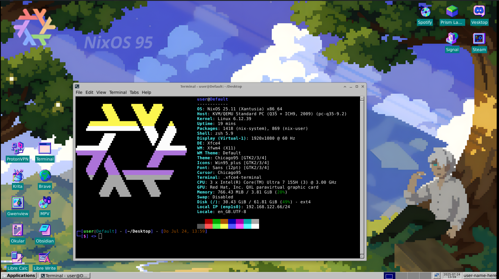
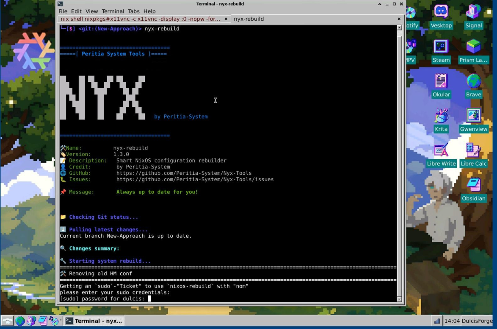
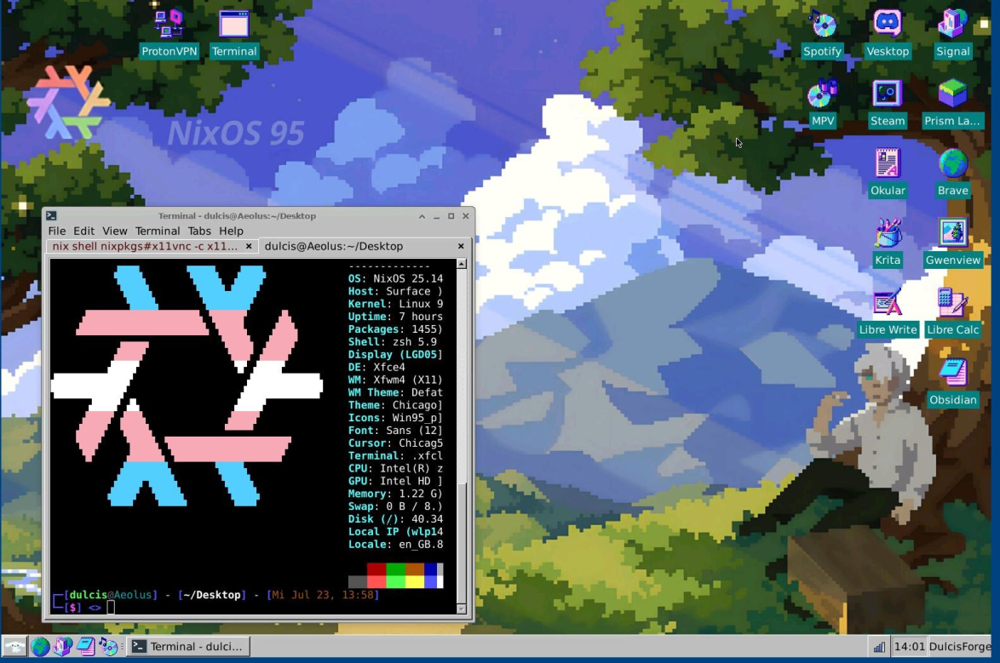
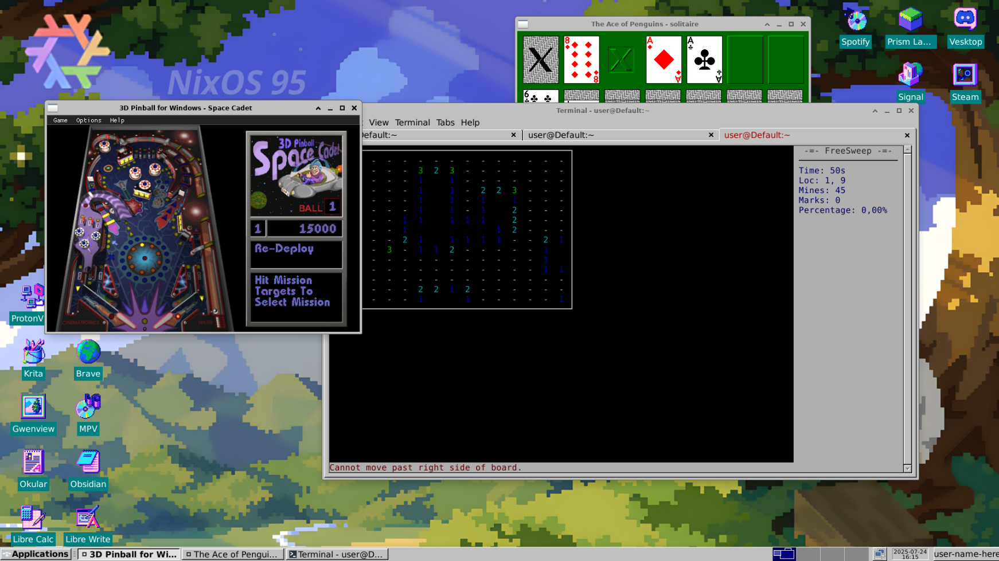

# NixOS-95

*A nostalgic Windows 95-inspired NixOS setup with modern pastel vibes.*

This is a **NixOS configuration** designed to evoke the pixel-perfect charm of **Windows 95**, infused with a clean, soft pastel aesthetic. Lightweight, customizable, and perfect for retro lovers or low-spec setups.

---

## 🖥️ System Overview

* **OS**: NixOS
* **DE**: XFCE (customized)
* **GTK Theme**: [Chicago95](https://github.com/grassmunk/Chicago95)
* **Icons & Wallpapers**: [aconfuseddragon](https://aconfuseddragon.itch.io/)


---

## 📁 Directory Overview

<details>
<summary>tree .</summary>

```bash
NixOS-95/
├── flake.nix
├── flake.lock
├── Modules/
│   ├── Applications/
│   └── System/
├── nixos95
│   ├── dotfiles/
│   ├── core.nix
│   ├── default.nix
│   ├── desktop.nix
│   ├── keybinds.nix
│   ├── taskbar.nix
│   └── theme.nix
├── Ressources/
│   ├── Icons/
│   ├── Images/
│   │   └── Wallpapers/
│   └── Themes/
├── README.md
```

</details>

---
## Installation - BETA

> Requirements:
  nix.settings.experimental-features = ["nix-command" "flakes" "pipe-operators"]; 
  Enabled


### 1. Add Nyx to your flake

```nix
# flake.nix
{
  inputs = {
    nixos95.url = "github:Peritia-System/NixOS-95/Dev";
    nixos95.inputs.nixpkgs.follows = "nixpkgs";
  }
  outputs = inputs @ { nixpkgs, nixos95, ... }: {
    nixosConfigurations.HOSTNAME = nixpkgs.lib.nixosSystem {
      modules = [ ./configuration.nix ];
    };
  };
}
```

### 2. Import in Configuration.nix

```nix
# configuration.nix
{
  imports = [ inputs.self.nixosModules.nixos95 ];
}
```

### 3. Enable modules

```nix
{
  # configuration.nix / or sth imported by the main config
  nixos95 = {
    enable = true;
    user = "alex";

    taskbar = {
      homeIcon = "whisker-menu-button";
      battery-plugin.enable = false;
      applications = [
        {
          name = "Brave";
          description = "Browse the Web";
          pkg = pkgs.brave;
          icon = "world";
        }
        {
          name = "Signal";
          description = "Private Messenger";
          pkg = pkgs.signal-desktop;
          icon = "signal";
        }
        {
          name = "Obsidian";
          description = "Markdown Editor";
          exe = "obsidian %u";
          icon = "obsidian";
        }
        {
          name = "Spotify";
          description = "Spotify Music";
          exe = "spotify %U";
          icon = "spotify";
        }
      ];
    };

    keybinds = {
      commands = [
        { key="<Super>l";  exe="xflock4"; }
      ];
    };
  };

}
```

4. **Build and switch to the system configuration**:

   ```bash
   sudo NIX_CONFIG="experimental-features = nix-command flakes pipe-operators" nixos-rebuild switch --flake .#default
   ```
w

### Experimental Features

NixOS-95 relys on multiple experimental nix features. These are:
1. [flakes](https://wiki.nixos.org/wiki/Flakes)
2. [pipe-operators](https://nix.dev/manual/nix/2.26/language/operators#pipe-operators)
They are needed to activate the configuration.

To enable them in your config set:
```nix
nix.settings.experimental-features = [
    "flakes" "pipe-operators"
];
```

### Rebuild Notes

Due to how **Home Manager** and XFCE handle theming, changes may not fully apply on the first attempt.

**For best results:**

1. Rebuild twice
2. Log out and back in after each rebuild

---

## Features

* Pixel-style retro desktop with pastel polish
* Lightweight and XFCE-powered (great for low-spec machines)
* Flake-based configuration with easy updates
* Themed with Chicago95 and matching icon set

---

## Showcase




<details>
<summary>More Screenshots</summary>

  
  


**Reddit Post:**  
👉 [See the Reddit showcase post](https://www.reddit.com/r/unixporn/comments/1m865np/xfce_win95_themed_rice_nixos95/)


</details>


---

## Final Thoughts

This setup was built for my boyfriend to use during school.
I love how this setup turned out—it's nostalgic and clean, so I wanted to give more people the opportunity to use it.
Hope you enjoy it!
